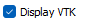
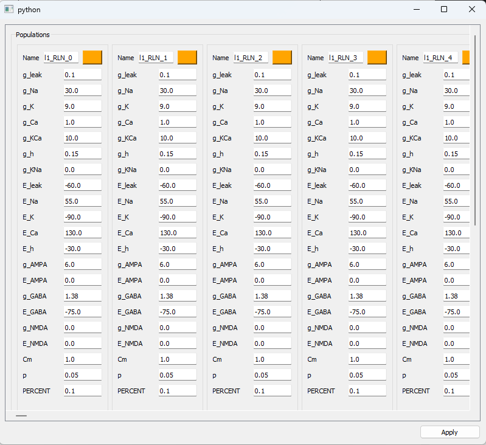
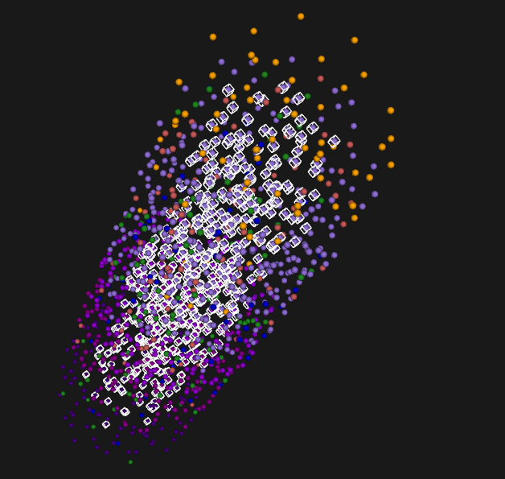
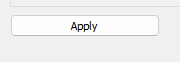
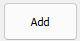

  

**Manual**

**NeoCoMM:** Neocortical Computational Microscale Model

Table of Contents

[1\. Overview 2](#_Toc151722042)

[2\. How to install and open the software 2](#_Toc151722043)

[3\. The Graphical Interface 2](#_Toc151722044)

[**3.1.** The Simulation tuning 3](#_Toc151722045)

[1.1.1. Choose Tissue type 3](#_Toc151722046)

[1.1.2. Choose tissue geometry 3](#_Toc151722047)

[1.1.3. Choose number of neurons by layer and their types 3](#_Toc151722048)

[1.1.4. Create afference matrix 4](#_Toc151722049)

[1.1.5. Select the shape of the tissue and compute the connectivity 6](#_Toc151722050)

[1.1.6. Define Pyramidal cell subtype 8](#_Toc151722051)

[1.1.7. Define the stimulation of distant cortex 8](#_Toc151722052)

[1.1.8. Define the stimulation of Thalamus 9](#_Toc151722053)

[1.1.9. Define the parameter of the simulation 9](#_Toc151722054)

[4\. Modify neuron instances 11](#_Toc151722055)

[5\. Views 20](#_Toc151722056)

[**5.1.** LE transmembrane voltage view: 20](#_Toc151722057)

[**5.2.** The LFP view: 22](#_Toc151722058)

[**5.3.** Tissue 3D view: 23](#_Toc151722059)

[**5.4.** connectivity view: 24](#_Toc151722060)

[**5.5.** stimulation view: 24](#_Toc151722061)

[**5.6.** Load/Save simulation 25](#_Toc151722062)

[6\. Tutorial 25](#_Toc151722063)

[**6.1.** From sratch 25](#_Toc151722064)

[**6.2.** From a save file 28](#_Toc151722065)

# Overview

This manual is intended to help any user to perform computational simulations at microscale of epileptiform events using NeoCoMM. Although it mainly focuses on interictal epileptic pattern simulations, other type of neural activities can be simulated by adjusting the neural network parameters.

# How to install and open the software

Clone the repository from <https://gitlab.univ-rennes1.fr/myochum/neocomm>

Or from Pypi : Pip install NeoCOMM

From the Terminal, type “python NeoComm.py”
 

# The Graphical User Interface
 

The first left third of the screen is dedicated to the tuning of the simulation, the middle of the screen is dedicated to view the signal respond of the simulation (membrane potentials and LFP signals). The left third of the screen is dedicated to view the tissue, the connectivity and the stimulation.

The first time the tissue model is created can be long due to some python just in time compilation of the model.

## The Simulation tuning
 
 

In this part, every subsection can be clicked on and will unfold the corresponding layout.

1.  

### Choose Tissue type
 
 

Choose if the tissue is Human, Rat or Mouse

### Choose tissue geometry

 

Define the geometry of the tissue, click on 
 
 to validate

### Choose number of neurons by layer and their types
 
 

Define the number of neurons in each layer. Click on Enter after entering a value to consider it. If you enter a total number of cell, this total number is split onto the number of cell in each layer by conserving the ratio between them. The repartition of neuron types can also be set here and you must click on 
 
 to apply them.

### Create afference matrix

This matrix is used to compute the synaptic connectivity among neurons. It defines how many connection there will be between one neurons type in a layer source toward one neurons type in a layer target (can be in the same layer).

 

Select  if you want the matrix to be used as a percentage value of the total amount of neuron.

Select  if you want to use the matrix as number of neuron directly

Click on  allow you to modify the matrix within a new window

The selected part can be modify by adding, subtract, multiply, divide by the number in the value field. The Î allow you to round up the selected matrix values. The matrix can be save and reload thank to the  buttons.

Click on  to apply the changes

Click on  allow you to see exactly how many neurons are connected together (if the percentage of the number of cell is considered)

### Select the shape of the tissue and compute the connectivity

You can select different kind of geometry for the tissue : 

The allow you to seed the result if the value is different of zero (the output of the placement and the connectivity matrix will always be the same)

will make the neurons placement in the tissue (it also automatically create the connection matrix), once done the 3D view to the right will display them:

create the associated connectivity matrix and display it in the connectivity matrix view:

The connectivity matrix can be computed without making a new cells placements. For instance if the afference matrix have changed without changing the cell number and type, then a connectivity matrix can be computed again.

### Define Pyramidal cell subtype

Select the percentage of each PC subtype (each column must sum up to 1). Click on to consider the changes.

### Define the stimulation of distant cortex

Here the user can define the various parameters for the distant cortex stimulation. The seed here is apply also to the Thalamus stimulation in order to fix the simulation. If the seed is different of zero then the simulation will be the same.

### Define the stimulation of Thalamus

Configure the Thalamus stimulation

### Define the parameter of the simulation

Simulation duration is the time the simulation will last. The sampling frequency is given in kHz.

You may select a one shot stimulation (only one stimulation will be apply) or a periodic stimulation (the stimulation will be repeated every the given period (time in ms).

Stim Start allow to select the start of the stimulation (or the position of the stimulation is One shot is picked up). The stim stop is the end of the stimulation.

allows to display or not the 3D view of the neuron positions

allows you to display the transmembrane voltages or not. (to uncheck if the number of signals to plot is really huge)

select a certain percentage of the signal to plot. By default, 30% means that only 30% of each neuron types in each layer will be displayed.

this button should be used if the model itself or if the number of neuron or type have changed (from the tab “% of cell” for instance)

allows you to access to every instance of neurons in a single window (could be long to display if the number of neurons is hugee)

 

Every parameter could be tuned manually. Don’t forget to click on the apply button to confirm the changes you made.

allows you to modify several neuron instances at once. This is convenient when the number of neurons gets large.

reset all variable states of the model instances.

allows you to save the state of the last simulation (transmembrane voltages and PSPs)

Position an electrode as a disk or a cylinder and apply the CSD computation by clicking on 

 set the position of the center of the disk

set the radius and both inclination in degree

check to display the spectrogram instead of the temporal signal.

# Modify neuron instances

click on this button

To access to this window:

If you click on a neuron in the 3D view it will appear with a box around it

And it information will be automatically loaded in the left panel

You can also from this panel chose a neuron by selected it on the combobox 

From the right panel, you can select several cell with the same type of the selected cell (from the left panel)

You can select on which layer the neurons will be selected:

Example by selecting every PC from layer 2 and 3

You can select neurons by their number

You can select the neurons by with a sting caracters in their names

Ex: 

Ex 

 
select a cube around the selected cell

Once you selected the cell that you want to modify and set the new parameter of the model you want to apply, just click on the apply button. 

If you don’t want to modify the names or the colors of the selected neurons, uncheck those checkbox 

Every selected cell will have now the new parameter.

This particular button

 allows you to modify one parameter for every selected cell without modified the others.

The parameter of the current neuron can be save and load in/from a file thanks to those two buttons 

# Views

## The transmembrane voltage view

 multiply the amplitude by the factor. Press Enter to validate (it is only a representation factor, the transmembrane voltage values remains the same)

 time that is display on the screen. If the time is reduced, a slider bar appears below the view to let you navigate between time windows

 allow you to add space between the signal

For instance with 5 

A slider bar appears to the right of the plot to navigate vertically

 change the thickness of the lines

allows you to select the signal you want to see

For instance

Will display only three signal

 will display the matplotlib toolbox
 on the top of the view.

 modifies the vertical gray line that is plot every some ms.

 allow to filter the signal with various kind of filters:

You have to select the kind of filter

Then enter the corresponding parameters for that selected filter

Then click  to add you filter. Note that several filter can be set consecutively.

Once all filter have been set up, click on  to validate

 select to apply the filters

 allows you to save the transmembrane voltage in different formats: 

## The LFP view

Once the LFP is computed, it is display in the LFP view

It is possible to also display the spectrogram

## Tissue 3D view

The VTK view allows to see the 3D representation of the positions and types of neurons. It also represent the electrode position and shape.

 set the radius for the neuron (only for the view)

 apply a scaling on the 3D view

 redraw the 3Dview

## connectivity view

This view represent the synaptic connections that exist in the tissue. Each line represent a target (the neuron that receive the synaptic input) and each column represent the source (the neurons that send an synaptic output). The last vertical line to the left represent the color (the type) of neurons that receive the synaptic connections for a line. The gray dot represent the thalamic input connection, and the black dot represent the Distant cortex connections. Each other dots represents a connection inside the tissue and their color represent the type of the neuron source for that connection.

## stimulation view

After a simulation, the user can click on  to display the stimulation signals that have been apply onto the Thalamus and the distant cortex.

## Load/Save simulation

 the simulation can be save in a text file and load to retrieve the simulation. If seed have been enter properly, the simulation will be exactly the same.

# Tutorial

## From sratch

Open the software

Select a tissue type

Enter a total number of 2002 cells en click Enter

Choose a cylinder shape for the cortical column and a seed value of 10. Then press “Place cells”

Wait for the placement to be done

The first time the model is used, the compilation of the model occur, it can take a minute, but will no longer be compiled after (just in time compilation in python numba module)

The view of the tissue and the connectivity are automatically updated

Click on run  to start the simulation

At the end the transmembran voltage view Is updated

Click on  to compute the LFP

It appear on the LFP view

## From a save file

To load a file go in Load Simulation

Select a file

Then the placement, the connectivity matrix and the model creation is done automatically

The views are updated

You may adapt the simulation from here

Click on to launch the simulation

Click on to display the LFP

